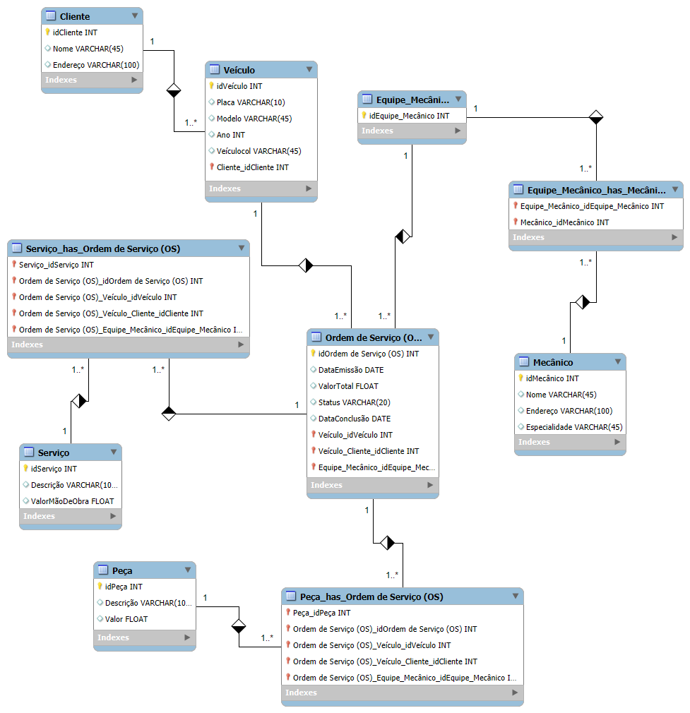

# Sistema de Controle e Gerenciamento de Ordens de Serviço em Oficina Mecânica

## Objetivo
Este projeto tem como objetivo desenvolver um sistema para controle e gerenciamento da execução de ordens de serviço em uma oficina mecânica. O sistema gerencia clientes, veículos, mecânicos, equipes, ordens de serviço, serviços e peças.

## Narrativa
Clientes levam veículos à oficina mecânica para serem consertados ou para passarem por revisões periódicas. Cada veículo é designado a uma equipe de mecânicos que identifica os serviços a serem executados e preenche uma OS com data de entrega. A partir da OS, calcula-se o valor de cada serviço, consultando-se uma tabela de referência de mão-de-obra. O valor de cada peça também irá compor a OS. O cliente autoriza a execução dos serviços. A mesma equipe avalia e executa os serviços. Os mecânicos possuem código, nome, endereço e especialidade. Cada OS possui: n°, data de emissão, um valor, status e uma data para conclusão dos trabalhos.

## Esquema Conceitual
O esquema conceitual inclui as seguintes entidades e relacionamentos:

### Entidades e Atributos:

1. **Cliente**
   - idCliente (INT)
   - Nome (VARCHAR(45))
   - Endereço (VARCHAR(100))

2. **Veículo**
   - idVeículo (INT)
   - Placa (VARCHAR(10))
   - Modelo (VARCHAR(45))
   - Ano (INT)
   - Cliente_idCliente (INT) (FK)

3. **Mecânico**
   - idMecânico (INT)
   - Nome (VARCHAR(45))
   - Endereço (VARCHAR(100))
   - Especialidade (VARCHAR(45))

4. **Equipe**
   - idEquipe (INT)
   - NomeEquipe (VARCHAR(45))

5. **Equipe_Mecânico** (Relacionamento entre Mecânico e Equipe)
   - Equipe_idEquipe (INT) (FK)
   - Mecânico_idMecânico (INT) (FK)

6. **Ordem de Serviço (OS)**
   - idOS (INT)
   - DataEmissao (DATE)
   - ValorTotal (FLOAT)
   - Status (VARCHAR(20))
   - DataConclusao (DATE)
   - Veículo_idVeículo (INT) (FK)
   - Equipe_idEquipe (INT) (FK)

7. **Serviço**
   - idServiço (INT)
   - Descrição (VARCHAR(100))
   - ValorMãoDeObra (FLOAT)
   
8. **Peça**
   - idPeça (INT)
   - Descrição (VARCHAR(100))
   - Valor (FLOAT)

9. **Serviço_OS** (Relacionamento entre Serviço e OS)
   - OS_idOS (INT) (FK)
   - Serviço_idServiço (INT) (FK)
   - Quantidade (INT)

10. **Peça_OS** (Relacionamento entre Peça e OS)
    - OS_idOS (INT) (FK)
    - Peça_idPeça (INT) (FK)
    - Quantidade (INT)

### Relacionamentos:
- **Cliente** 1:N **Veículo**
- **Mecânico** N:N **Equipe**
- **Veículo** 1:N **Ordem de Serviço (OS)**
- **Equipe** 1:N **Ordem de Serviço (OS)**
- **Serviço** N:N **Ordem de Serviço (OS)**
- **Peça** N:N **Ordem de Serviço (OS)**

## Diagrama de Entidade-Relacionamento (ERD)


## Como Usar
1. **Setup do Banco de Dados**: Crie o banco de dados e as tabelas conforme o esquema conceitual descrito.
2. **População de Dados**: Insira dados de exemplo nas tabelas para testar a funcionalidade do sistema.
3. **Execução de Consultas**: Execute consultas para interagir com os dados e verificar a funcionalidade do sistema.

### Exemplos de Consultas SQL

```sql
-- Exemplo de consulta para listar todos os clientes
SELECT * FROM Cliente;

-- Exemplo de consulta para listar todas as ordens de serviço de um veículo específico
SELECT * FROM Ordem_de_Serviço WHERE Veículo_idVeículo = 1;

-- Exemplo de consulta para calcular o valor total das ordens de serviço de um cliente
SELECT Cliente.idCliente, Cliente.Nome, SUM(Ordem_de_Serviço.ValorTotal) AS TotalGasto
FROM Cliente
JOIN Veículo ON Cliente.idCliente = Veículo.Cliente_idCliente
JOIN Ordem_de_Serviço ON Veículo.idVeículo = Ordem_de_Serviço.Veículo_idVeículo
WHERE Cliente.idCliente = 1
GROUP BY Cliente.idCliente, Cliente.Nome;
